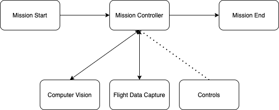

# README

## Overview

The mission controller is a centralized controller for the execution of the various mission tasks. Using 
multiprocessing, it syncs the tasks and runs them in parallel, allowing sharing of data between them.  

## High-level Code

All the mission tasks of computer vision, flight data capture, and controls system are run in parallel from
the mission controller. For all the mission tasks, the mission controller sets a mission length of 20 seconds.
Each task is run in parallel and their start/end times are synced with the mission length.

The `multiprocessing` library is used for parallelism. `multiprocessing.Manager()` is used to manage the start
and end of each task. `multiprocessing.Manager().dict()` is used to share the rocket prediction information 
between the computer vision and the controls system.

Overall, the mission controller keeps track of the mission length, the directory to write the flight data
to, the locations of the EfficientDet-Lite2 model and the labels file, the camera dimensions, and the object
detection score threshold. The mission length is used to sync execution of each mission task.

The computer vision, flight data capture, and controls system are all started at the same time with the same 
mission length, so they end at the same time. The mission controller starts each as a separate process and 
joins them all together when the mission is complete. During parallel execution, the computer vision shares the x, y 
bounding box coordinates of the best rocket prediction with the controls system.

Mission flow:
