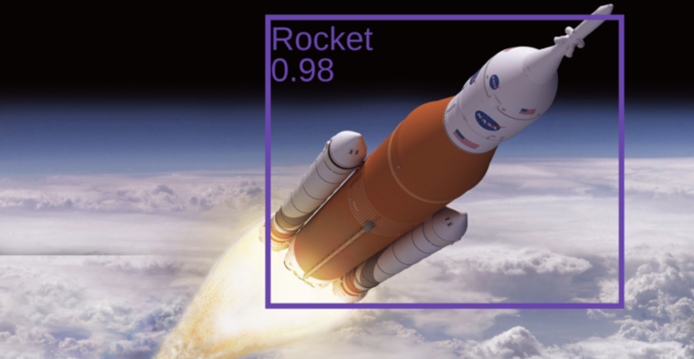

# README

## Setup

There are required libraries for the computer vision to run. Check how to appropriately set up 
[here](./SETUP.md).

## Overview
The computer vision code uses TensorFlow Lite with Python3 on a Raspberry Pi to perform real-time 
object detection using images streamed from the Pi Camera using a Google Coral USB Accelerator. 
EfficientDet-Lite2 is used as the object detection model, since it's lightweight and compatible 
with the Coral. The goal is to predict a bounding box around the rocket with the highest score.

In a `mission` run, the computer vision is parallelly run in the background with the other mission
tasks and it's prediction (the x, y coordinates of each bounding box corner) is shared with the controls.

In a `practice` run, the camera preview is opened and a bounding box is displayed over the prediction
to determine correct functionality.

## High-level Code

Like the other mission tasks, the run length of the computer vision is the mission length of 20 seconds.
The EfficientDet-Lite2 model is at [bx4-master/cv/efficientdet-lite2-rocket-quant_edgetpu.tflite](./efficientdet-lite2-rocket-quant_edgetpu.tflite)
and the rocket labels are at [bx4-master/cv/rocket-labels.txt](./rocket-labels.txt). The dimension for
EffcientDet-Lite2 are 448x448, so the Pi Camera dimensions are set to 448x448 as well. Because we're detecting
a single rocket with a mostly solid black space background using a mobile object detection model, the score 
threshold is set to 25. To display a bounding box over the prediction in the camera's view for a `practice` 
run, `Annotator` from [bx4-master/cv/annotation.py](./annotation.py) is used.

Overall, the Pi Camera captures an image and feeds it into the EfficientDet-Lite2 model. The EfficientDet-Lite2
model returns all rocket predictions in the image with a score higher than 25. The prediction with the highest
score is used as the official prediction and that is shared with the controls system.

Detection example:
