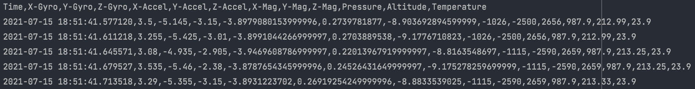

# README

## Tutorial

Some software and hardware configurations need to be done to connect the Pololu AltIMU-10 v5 to
to the Raspberry Pi. Check how to appropriately set up [here](./Pololu%20AltIMU-10%20v5%20Tutorial%20for%20RPI.pdf).

## Overview
The data read/write code captures related flight data with the Pololu AltIMU-10 v5 and writes it 
to a file.

In a `mission` run, the flight data capture is parallelly run in the background with the other mission
tasks and the data is written to a file.

In a `practice` run, a terminal window is opened and the flight data is displayed there to determine
correct functionality.

## High-level Code

Like the other mission tasks, the run length of the flight data capture is the mission length of 20 
seconds. Flight data is saved in [bx4-master/data/output/IMU/](./output/IMU) with the filename format
`%Y-%m-%d_%H-%M-%S`. At each event, the x, y, and z gyroscope, x, y, and z accelerometer, x, y, and z
magnetometer, pressure, altitude, and temperature information for the payload is saved with a 
corresponding timestamp.

For the accelerometer and gyroscope data, `LSM6DS33` from [bx4-master/data/lsm6ds33.py](./lsm6ds33.py)
is used. For the magnetometer data, `LIS3MDL` from [bx4-master/data/lis3mdl.py](./lis3mdl.py) For the 
pressure and temperature data, `LPS25H` from [bx4-master/data/lps25h.py](./lps25h.py) is used.

Flight data capture example:
